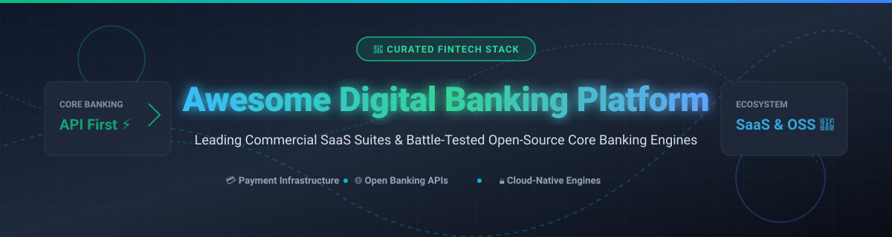

# 🏦 Awesome Digital Banking Platform Ecosystem



<a href="https://github.com/ishandutta2007/Awesome-Awesome-Awesome"></a><a href="https://discord.gg/jc4xtF58Ve"></a> [](https://awesome.re) [](https://opensource.org/licenses/MIT) [](http://makeapullrequest.com) <a href="https://github.com/ishandutta2007"></a>

> **A curated, SEO-optimized list of top enterprise SaaS suites, cloud-native core banking engines, open-source payment rails, and Open Banking API frameworks for modern digital financial services.**

*Focused on Retail & Business Digital Banking, Core Engagement Layers, Omnichannel Banking UX, Composable Core Banking, and Open Financial Infrastructure.*

**Last updated: October 2026**

---

## 📑 Table of Contents

- [📊 Market Overview & Industry Dynamics](#-market-overview--industry-dynamics)
- [🏢 SaaS & Commercial Banking Platforms](#-saas--commercial-banking-platforms)
- [🔓 Open-Source GitHub Projects](#-open-source-github-projects)
- [🏗 Architectural Blueprint](#-architectural-blueprint)
- [🤝 How to Contribute](#-how-to-contribute)
- [💖 Support & Sponsorship](#-support--sponsorship)
- [📈 Star History](#-star-history)
- [⚖️ Disclaimer & Risk Notice](#%EF%B8%8F-disclaimer--risk-notice)

---

## 📊 Market Overview & Industry Dynamics

> 💡 **Market Size & Fragmentation Insights:**  
> The global Digital Banking Platform market size is estimated at **$10.5 Billion - $13.8 Billion** (projected to reach **~$30+ Billion by 2032** growing at a CAGR of **~14.8%**). The market is **moderately fragmented**, with traditional core banking behemoths (Temenos, Fiserv, Finastra) competing alongside specialized cloud-native SaaS providers (Mambu, Thought Machine, Backbase) and niche open-source infrastructure engines. No single vendor holds a winner-take-all monopoly, making composable, API-led banking architectures essential for modern financial institutions.

---

## 🏢 SaaS & Commercial Banking Platforms

*The table below categorizes premier commercial digital banking software platforms, ranked by company size (Valuation / Annual Market Revenue in Descending Order).*

| 🏛️ Platform / Vendor | 📊 Enterprise Scale (Valuation / Revenue) | 💰 Specific Starting Tier Pricing | 🎁 Free Tier / Trial Limit | 🎯 Core Focus & Capabilities |
| :--- | :--- | :--- | :--- | :--- |
| **[Temenos Infinity](https://www.temenos.com/)** | **$6.8B Market Cap** ($1.05B Annual Revenue) | **$15,000 / month** base SaaS tier for mid-tier institutions | **30-Day Developer Sandbox** access upon approval | Cloud-native digital front-end and composable banking suite for retail & corporate. |
| **[Mambu](https://www.mambu.com/)** | **$5.5B Valuation** (~$220M ARR) | **$5,000 / month** base SaaS fee + **$0.08 / active account** | **14-Day Guided Sandbox Trial** (interactive demo tenant) | Pure SaaS cloud-native core banking platform powering fintechs and challenger banks. |
| **[Q2 Holdings (NYSE: QTWO)](https://www.q2.com/)** | **$2.7B Market Cap** (~$700M Annual Revenue) | **$12,000 / month** minimum core subscription tier | **No Free Trial** (Sales-led interactive sandbox demo) | Digital banking transformation platform for US credit unions & community banks. |
| **[Thought Machine](https://www.thoughtmachine.net/)** | **$2.7B Valuation** ($100M ARR) | **$10,000 / month** base Vault licensing + **$0.10 / account / yr** | **30-Day Dev Portal Access** for verified enterprise partners | Vault Core & Vault Payments: Next-gen microservices core banking engine. |
| **[Backbase](https://www.backbase.com/)** | **$2.6B Valuation** ($350M Revenue) | **$1,200 / participant** for dev training packages (Platform custom enterprise quotes) | **No Free Trial** (Personalized live executive demo) | Engagement Banking Platform (EBP) replacing legacy banking UI/UX layers. |
| **[Alkami Technology (NASDAQ: ALKT)](https://www.alkami.com/)** | **$2.4B Market Cap** ($528M Annual Revenue) | **$8,000 / month** base platform recurring subscription | **No Free Trial** (Sales-led product walkthrough) | Cloud-based digital banking, account opening, and marketing suite. |
| **[Finastra](https://www.finastra.com/)** | **$2.1B Valuation** ($1.7B Revenue) | **$14,000 / month** FusionFabric.cloud enterprise tier | **30-Day FusionFabric.cloud API Sandbox** | Global financial software suite covering digital banking, lending, and trade finance. |
| **[Amount](https://www.amount.com/)** | **$1.0B Valuation** (Series D Unicorn) | **$7,500 / month** platform tier + transaction volume fees | **No Free Trial** (Custom enterprise solution demo) | Digital origination, account opening, and point-of-sale financing platform. |
| **[SDK.finance](https://sdk.finance/)** | **~$25M Valuation** (Privately Held) | **$900 / month** (Dev Mode) / **$2,500 / month** (Live SaaS Mode) | **Unlimited Interactive Sandbox Access** (back-office & mobile demo) | API-first digital wallet and core banking software with source code license option. |

---

## 🔓 Open-Source GitHub Projects

*Leading open-source core banking engines, payment orchestration gateways, open banking APIs, and ledger systems, ranked by GitHub Star Count (Descending).*

| 🚀 Repository & Link | ⭐ GitHub Stars (Social) | 🧰 Domain / Category | 📝 Description & Tech Stack |
| :--- | :--- | :--- | :--- |
| **[juspay/hyperswitch](https://github.com/juspay/hyperswitch)** | [](https://github.com/juspay/hyperswitch/stargazers) | Payment Gateway & Orchestration | High-performance, composable payment switch built in Rust to connect multiple payment processors via a unified API. |
| **[btcpayserver/btcpayserver](https://github.com/btcpayserver/btcpayserver)** | [](https://github.com/btcpayserver/btcpayserver/stargazers) | Crypto Payment Processor | Self-hosted, open-source Bitcoin & crypto payment gateway with zero transaction fees and strict privacy controls. |
| **[killbill/killbill](https://github.com/killbill/killbill)** | [](https://github.com/killbill/killbill/stargazers) | Billing & Subscription Core | Enterprise-grade open-source subscription billing and payment processing platform. |
| **[apache/fineract](https://github.com/apache/fineract)** | [](https://github.com/apache/fineract/stargazers) | Open Core Banking Engine | The gold standard open-source core banking platform—handles accounts, deposits, loans, and interest calculations. |
| **[OpenBankProject/OBP-API](https://github.com/OpenBankProject/OBP-API)** | [](https://github.com/OpenBankProject/OBP-API/stargazers) | Open Banking Middleware | RESTful API middleware supporting PSD2, Open Banking UK, and global Open Finance standards for legacy cores. |
| **[formancehq/ledger](https://github.com/formancehq/ledger)** | [](https://github.com/formancehq/ledger/stargazers) | Programmable Financial Ledger | Cloud-native, multi-posting ledger with a custom domain-specific language (Numscript) for complex money movement. |
| **[jpos/jPOS](https://github.com/jpos/jPOS)** | [](https://github.com/jpos/jPOS/stargazers) | ISO-8583 Payment Switch | Java-based financial messaging bridge implementing ISO-8583 standards for card processing and ATM network authorization. |
| **[moov-io/ach](https://github.com/moov-io/ach)** | [](https://github.com/moov-io/ach/stargazers) | Automated Clearing House (ACH) | Go-based open-source reader, writer, and validator for NACHA ACH file structures used in US banking transfers. |
| **[blnkfinance/blnk](https://github.com/blnkfinance/blnk)** | [](https://github.com/blnkfinance/blnk/stargazers) | Fintech Core Ledger | Lightweight double-entry ledger database built for managing multi-currency fintech ledger balances. |
| **[openMF/web-app](https://github.com/openMF/web-app)** | [](https://github.com/openMF/web-app/stargazers) | Digital Banking Web UI | Redesigned Mifos X web client built with Angular for managing financial inclusion, microfinance, and banking operations. |
| **[openMF/mifos-mobile](https://github.com/openMF/mifos-mobile)** | [](https://github.com/openMF/mifos-mobile/stargazers) | Mobile Banking Client | Native Android app enabling client self-service banking on top of Apache Fineract / Mifos X backends. |
| **[openMF/mifos-pay](https://github.com/openMF/mifos-pay)** | [](https://github.com/openMF/mifos-pay/stargazers) | Digital Wallet Client | Open-source mobile wallet application for P2P payments, merchant QR scanning, and financial transfers. |
| **[adorsys/open-banking-gateway](https://github.com/adorsys/open-banking-gateway)** | [](https://github.com/adorsys/open-banking-gateway/stargazers) | Open Banking Gateway | Connector infrastructure providing unified access to European XS2A / PSD2 compliant banking interfaces. |

---

## 🏗 Architectural Blueprint

```
 ┌────────────────────────────────────────────────────────────────────────┐
 │                     DIGITAL BANKING CHANNELS (UX)                      │
 │    Mobile Banking (iOS/Android)  •  Web Portal  •  API Integrations    │
 └───────────────────────────────────┬────────────────────────────────────┘
                                     │
 ┌───────────────────────────────────▼────────────────────────────────────┐
 │                     DIGITAL ENGAGEMENT LAYER                           │
 │     Backbase EBP  •  OpenBankProject  •  Keycloak IAM  •  Mifos Mobile │
 └───────────────────────────────────┬────────────────────────────────────┘
                                     │
 ┌───────────────────────────────────▼────────────────────────────────────┐
 │                     CORE BANKING & LEDGER ENGINE                       │
 │  Apache Fineract  •  Formance Ledger  •  Mambu SaaS  •  Thought Machine │
 └───────────────────────────────────┬────────────────────────────────────┘
                                     │
 ┌───────────────────────────────────▼────────────────────────────────────┐
 │                    PAYMENTS & INFRASTRUCTURE RAILS                     │
 │      Hyperswitch  •  Moov ACH  •  jPOS ISO-8583  •  KillBill SaaS      │
 └────────────────────────────────────────────────────────────────────────┘
```

---

## 🤝 How to Contribute

Contributions are welcome! Please follow these simple guidelines:

1. **Fork the repository** 🍴
2. **Add/Edit software entries** in `README.md` following the tabular layout.
3. Include factual data: Platform Name, Verified Pricing, Free Tier / Trial limits, Star Count badges, and official links.
4. **Submit a Pull Request** with a clear explanation of your additions 🚀

---

## 💖 Support & Sponsorship

Thank you for exploring and utilizing this curated repository! If you find this resource helpful for your fintech projects, core banking research, or enterprise planning, please consider supporting the project:

- ⭐ **Star this repository** to help others discover it.
- 🔀 **Fork and share** it with fellow developers, architects, and banking colleagues.
- ☕ **Buy me a coffee / Sponsor**: If you'd like to support ongoing curation and open-source contributions, you can sponsor via the [GitHub Sponsor Dashboard](https://github.com/sponsors/ishandutta2007).

Your support is greatly appreciated!

---

## 📈 Star History

[](https://star-history.dera.page/#ishandutta2007/Awesome-Digital-Banking-Platform&type=date&legend=top-left)

---

## ⚖️ Disclaimer & Risk Notice

- This repository is a **community-curated index** provided for informational, educational, and architectural evaluation purposes.
- **Regulatory Warning:** Operating live banking software requires appropriate financial licensing, PCI-DSS compliance, KYC/AML controls, SOC2 audits, and strict capital reserves.
- Open-source core banking engines provide architectural freedom but require full operational accountability by the deployment team.

---

<p center align="center">Made with ❤️ for FinTech Founders, Core Banking Architects, and Bank Digital Transformation Teams.</p>
